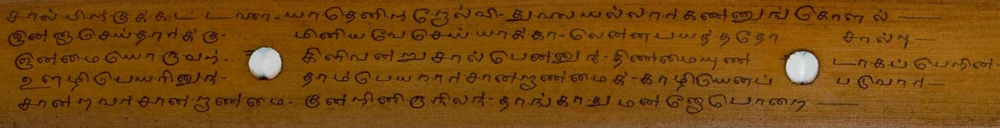
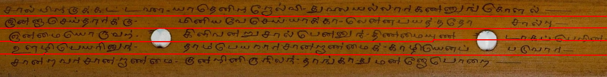
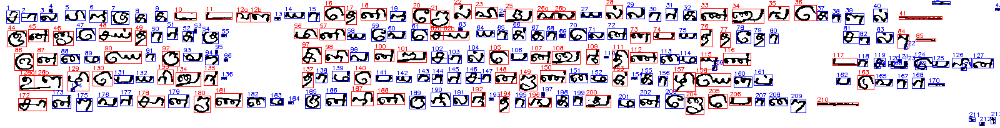

# Study Guide: Document Line & Character Segmentation

This project implements a complete, rule-based image processing pipeline for segmenting scanned or captured documents into individual lines of text and characters. It is particularly tailored to Indic scripts (like Tamil) where characters are highly curved, distinct symbols frequently overlap, and letters may touch.

This document serves as a self-study reference to understand the algorithms, workflow, and code structure of the project.

---

##  Core Workflow

The pipeline runs in five main stages:

```
[Input Image] 
      │
      ▼
1. Preprocessing ───► Denoising, Sharpening, and Adaptive Thresholding
      │
      ▼
2. Line Segmentation ──► CC Height Estimation & Dynamic Programming (DP) Path Tracing
      │
      ▼
3. Character Segmentation ──► Projection Profiling, Contour Extraction, & Box Merging
      │
      ▼
4. Joint Resolution ──► Two-Stage Width Filtering & Histogram-Based Splitting
      │
      ▼
5. Report & Outputs ──► Complete Output Folder Structure & Accuracy Score
```

---

##  Technical Approach & Key Concepts

### 1. Preprocessing & Denoising
To segment text accurately, noise must be eliminated without blurring character boundaries:
*   **Edge Sharpening:** Applies a 3x3 high-pass filter kernel to the grayscale image. This accentuates text boundaries and compensates for camera blur.
*   **Adaptive Thresholding:** Binarizes the image using a moving window (size 21x21) to compute local thresholds. This handles uneven document lighting or shadows.
*   **Noise Filtering:** 
    *   *Boundary-based (Contour) Filter:* Detects external contours and sets any contour with an area outside the valid text range to white (background).
    *   *Size-based Connected Components (CC) Filter:* Isolates connected pixel structures and removes tiny speckles (usually noise) or overly large regions (non-text borders).

### 2. Line Segmentation using Dynamic Programming
Standard horizontal projection profiling fails on documents with slightly curved, tilted, or overlapping lines of text. The pipeline overcomes this using pathfinding:
*   **Height Estimation:** Finds the median height of connected components across the document to set the baseline scale of the text.
*   **Separator Optimization:** Finds valleys (horizontal white space) on a smoothed vertical profile.
*   **Dynamic Programming Trace (`dp_trace`):** Traces a dividing path from left to right. The path minimizes a cost function:
    $$\text{Cost} = \text{DistanceTransformCost} + \text{TextCrossingPenalty} + \text{VerticalDeviationPenalty}$$
    *   The path prefers wide margins (high distance from text).
    *   Crossing black pixels (characters) carries a heavy cost penalty.
    *   Vertical movements are restricted to keep the path smooth.
    *   This forces the separator line to curve *around* descenders and ascenders rather than cutting through them.

### 3. Character Segmentation & Overlap Merging
Once lines are isolated into horizontal strips:
*   **Initial Blocks:** Calculates a vertical projection histogram (column-wise sum). Columns with zero text pixels act as coarse character boundary dividers.
*   **Contour Extraction:** Detects contours inside each block to isolate separate characters that happen to occupy the same vertical strip but don't touch in 2D space.
*   **Bounding Box Merging:** Sorts boxes from left to right. If two boxes overlap vertically or horizontally (e.g., accent marks or vowel modifiers), they are merged into a single bounding box.

### 4. Joint Character Splitting (Two-Stage Rule)
When characters touch, they form a single wide block. The pipeline detects and splits them:
*   **Stage 1 Filtering:** Shortlists character blocks whose width exceeds a multiplier of the global median width ($1.6 \times \text{AvgWidth}$).
*   **Stage 2 Filtering:** Calculates a refined average width specifically from the shortlisted wide characters. If a block is wider than $1.08 \times \text{RefinedAverageWidth}$, it is flagged for splitting.
*   **Split Validation & Execution:**
    1.  Validates that the aspect ratio is $> 1.6$.
    2.  Verifies the presence of a central valley (where the vertical projection drops below 30% of the surrounding peaks).
    3.  Finds the absolute minimum projection value in the middle 30% width of the character and splits the block vertically at that point into Part A and Part B.

---

##  Code Structure & Function Definitions

### [line_seg.py](line_seg.py) (Main Pipeline Coordinator)

*   `preprocess(img, is_crop=False, show=False)`
    *   *Purpose:* Cleans raw images. Converts to grayscale, sharpens, thresholds, and filters noise using contours and connected components.
    *   *Heuristic:* Adjusts parameters if processing an individual character crop (`is_crop=True`) to avoid filtering out thin parts of characters.
*   `estimate_height(binary)`
    *   *Purpose:* Calculates the median height of text structures to help determine line spacing and filter thresholds dynamically.
*   `detect_separators(binary, text_h)`
    *   *Purpose:* Detects rough horizontal zones between lines using a 1D Gaussian-smoothed horizontal profile.
*   `dp_trace(binary, y_start)`
    *   *Purpose:* Traces a smooth, curved path across the image starting from `y_start` that routes around text components using Dynamic Programming.
*   `process_image(path)`
    *   *Purpose:* The main pipeline controller. Coordinates preprocessing, line separation, per-line character analysis, the two-stage joint splitting logic, accuracy calculation, and saves the final visualizations.

### [char_seg.py](char_seg.py) (Character Segmentation Helpers)

*   `get_initial_blocks(line_binary)`
    *   *Purpose:* Scans the line strip column by column to locate initial text clusters using vertical projection peaks.
*   `merge_overlapping_boxes(chars, line_binary)`
    *   *Purpose:* Iteratively merges character bounding boxes that intersect in 2D space.
*   `adaptive_split_and_save(...)`
    *   *Purpose:* Separates disjoint components using contour areas and builds the base metrics array (bounding boxes, aspect ratios, area sizes) for each line.

---

##  Evaluation Metrics

At the end of processing, the console prints a **Segmentation Accuracy Report** containing:
*   **Clean/Good Characters:** Detections that were not flagged as merged or split.
*   **Split Characters:** Touch-merged character blocks that were successfully resolved.
*   **Likely Merged:** Blocks that are overly large but did not meet the splitting criteria.
*   **Segmentation Accuracy Score:** Evaluates the quality of segmentation:
    $$\text{Accuracy Score} = \frac{\text{Clean Chars} + \text{Split Chars}}{\text{Total Final Characters}} \times 100$$

---

## 🏃 How to Run the Tool

### Step 1: Install Dependencies
Ensure you have the required packages from `requirements.txt` installed inside your Python virtual environment:
```bash
pip install -r requirements.txt
```

### Step 2: Run the Pipeline
Execute `line_seg.py` in your shell:
```bash
python line_seg.py
```

You will see an interactive menu on the console:
```
==================================================
Document Segmentation Tool Menu
1. Process a single image (interactive file dialog)
2. Process all input images in the project directory
==================================================
Enter your choice (1 or 2):
```

*   **Option 1 (Single Image):** Opens a system file dialog to choose a file. It runs the pipeline visually, displaying the intermediate and final steps in OpenCV windows. Press any key on a visual window to finish.
*   **Option 2 (Batch Process):** Finds all `.png`, `.jpg`, and `.jpeg` images in the project root directory, processes them in a headless loop (suppressing pop-ups), and populates their corresponding subfolders under `output/`.

---

## 📂 Output Folder Structure

When an image (for example, `input-6.jpeg`) is processed, a directory named after the image is created under `output/input-6/` containing the complete set of visual outputs:

```
output/input-6/
├── cleaned.png               # Cleaned binary page (denoised text)
├── thresh.png                # Raw thresholded page (inverse binary)
├── line_1.png                # Cropped image of Line 1
├── line_1_chars/             # Folder containing initial character crops for Line 1
├── final_characters/         # Folder containing individual, isolated final character crops
├── joint_characters_rgb/     # Folder containing original color crops of touch-merged candidates
├── input_image.png           # A copy of the raw input image
├── line_segmented.png        # Input image with red lines showing DP-traced line separations
└── char_segmented.png        # Bounding boxes and sequence numbers overlaid on segmented text
```

---

## 📸 Visualizing Key Outputs

### 1. Input Image
The original document containing text to segment:


### 2. Line Segmentation Output
The document showing the separator boundaries (drawn in red) computed by the dynamic programming solver:


### 3. Character Segmentation Output
A final image displaying all segmented characters mapped onto a clean background, labeled with their sequence index and bounding box (red boxes denote characters that were split or flagged as merged):

