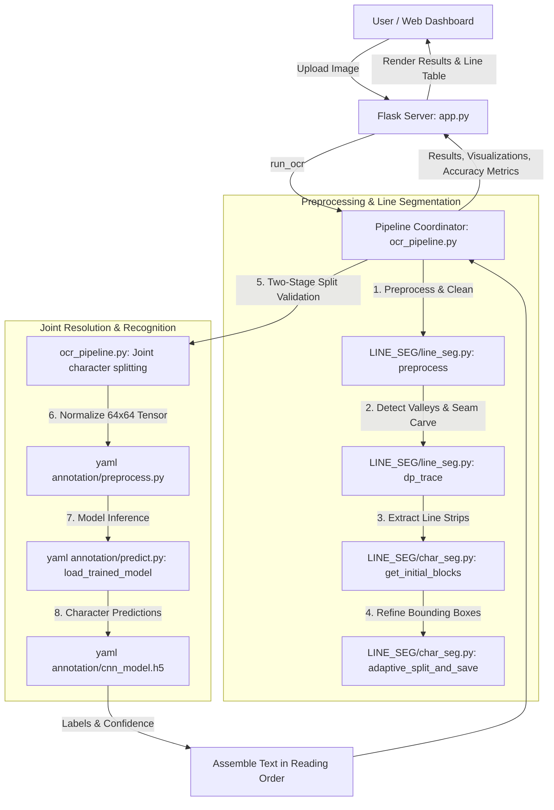

# Palm Leaf OCR - Ancient Manuscript Character Recognition

A system for transcribing ancient Tamil handwritten palm-leaf manuscripts into digital text using computer vision preprocessing, dynamic programming line segmentation, and a convolutional neural network (CNN).

---

## Table of Contents

1. [Overview](#overview)
2. [Architecture & Workflow](#architecture--workflow)
3. [Project Structure](#project-structure)
4. [Installation & Setup](#installation--setup)
5. [Running the Application](#running-the-application)
6. [Model Evaluation & Benchmarking](#model-evaluation--benchmarking)
7. [Technical Pipeline Details](#technical-pipeline-details)
8. [Dataset & Model Performance](#dataset--model-performance)

---

## Overview

Palm-leaf manuscripts contain classical literature, scientific records, and historical treatises. Digitizing them poses specific technical challenges:
- Handwritten, highly curved Indic scripts (Tamil)
- Varying line spacing, curved baselines, and ascender/descender overlaps
- Touching characters and degradation of physical media

This project provides:
1. **Adaptive Image Preprocessing:** Denoising, boundary and connected-component noise filtering, and Otsu thresholding.
2. **Seam-Carving Line Segmentation:** Dynamic programming path tracing (`dp_trace`) navigating inter-line valleys without cutting through characters.
3. **Character Segmentation & Joint Resolution:** Bounding-box projection profiling, 2D overlap merging, and two-stage histogram-based split resolution for touching glyphs.
4. **CNN Recognition Engine:** Character-level inference preserving exact reading order (top-to-bottom, left-to-right).
5. **Web Dashboard:** Upload, preview, segment, transcribe, and export text directly in the browser.

---

## Architecture & Workflow



---

## Project Structure

```
Palm-Leaf-Project/
├── app.py                         # Flask web server and API endpoints
├── ocr_pipeline.py                # End-to-end OCR coordinator
├── ocr_model_comparison.py        # Benchmark script comparing 6 OCR architectures
├── OCR_MODEL_COMPARISON_README.md # Model benchmark report and analysis
├── README.md                      # Primary project documentation
├── templates/
│   └── index.html                 # Web dashboard UI
├── output/                        # Output folder for exports and benchmark results
│
├── LINE_SEG/                      # Line and Character Segmentation Module
│   ├── line_seg.py                # Preprocessing, valley detection & DP seam tracing
│   ├── char_seg.py                # Projection profiling, overlap merging & character extraction
│   ├── README.md                  # Segmentation module reference
│   └── requirements.txt           # Segmentation dependencies
│
└── yaml annotation/               # CNN Character Recognition Module
    ├── cnn_model.py               # CNN architecture definition
    ├── dataset_loader.py          # Annotation parser and train/test splitter
    ├── preprocess.py              # Character crop preprocessing pipeline
    ├── train.py                   # Model training and metric visualizer
    ├── predict.py                 # Single-character CLI prediction tool
    ├── classes.npy                # Target character class labels
    ├── cnn_model.h5               # Pre-trained CNN model weights
    ├── README.md                  # Character recognition technical guide
    ├── requirements.txt           # Training and inference dependencies
    ├── dataset/                   # Dataset images and YAML bounding-box annotations
    ├── palm leaf annotated img/   # Source annotated palm-leaf manuscript images
    └── results/                   # Accuracy/loss curves and classification metrics
```

---

## Installation & Setup

### Requirements
- Python 3.10+ (Python 3.11 recommended)

### Setup Virtual Environment

```bash
# Clone the repository
git clone https://github.com/girijesh-s001/Palm-Leaf-Project.git
cd Palm-Leaf-Project

# Create and activate virtual environment
python -m venv .venv

# Windows:
.venv\Scripts\activate

# Linux/macOS:
source .venv/bin/activate

# Install dependencies
pip install flask opencv-python numpy scipy tensorflow scikit-learn matplotlib seaborn pyyaml pillow
```

---

## Running the Application

### 1. Web Dashboard

```bash
python app.py
```
Open your browser at **`http://localhost:5000`** to access the upload interface, view line/character segmentations, and copy recognized text.

### 2. Standalone Pipeline (CLI)

Run end-to-end OCR on an image file directly:

```bash
python ocr_pipeline.py path/to/manuscript.jpg
```

### 3. Standalone Segmentation Visualizer

Run line and character segmentation directly:

```bash
python LINE_SEG/line_seg.py path/to/manuscript.jpg
```

---

## Model Evaluation & Benchmarking

The project includes a comparative benchmark framework evaluating 6 OCR paradigms on the annotated Tamil palm-leaf dataset:

1. **Palm Leaf CNN (Baseline):** Dedicated segmentation and custom CNN pipeline
2. **PARSeq:** Permutation Autoregressive Sequence recognition
3. **PP-OCRv5:** Multilingual mobile OCR (`ta_PP-OCRv5_mobile_rec`)
4. **Donut:** Vision-Language Document Transformer
5. **Pixtral-12B:** Multimodal Vision-Language Model
6. **DeepSeek-OCR:** DeepSeek multimodal OCR

Run the benchmark:

```bash
# Benchmark on 5 test images (default)
python ocr_model_comparison.py --images 5

# Benchmark across all 10 annotated manuscripts
python ocr_model_comparison.py --images 10
```

Results are printed in a summary table and saved to `output/comparison/comparison_summary.csv`. For details, see [OCR_MODEL_COMPARISON_README.md](OCR_MODEL_COMPARISON_README.md).

---

## Technical Pipeline Details

1. **Adaptive Preprocessing:**
   - High-pass Laplacian sharpening kernel to accentuate faint ink strokes.
   - Local adaptive mean thresholding (window size 21, constant 11).
   - Dual-stage noise suppression: boundary contour area filtering and connected component filtering.

2. **Seam-Carving Line Tracing (`dp_trace`):**
   - Gaussian-smoothed 1D horizontal ink projection finds valley coordinates.
   - Dynamic programming computes an energy-minimizing path from x = 0 to x = W, heavily penalizing text collisions (+250) while biasing towards distance-transform white space and vertical smoothness.

3. **Character Segmentation & Overlap Merging:**
   - Vertical projection histogram determines character clusters.
   - 2D bounding boxes are iteratively unioned if horizontal/vertical bounds overlap.

4. **Joint Character Resolution:**
   - Flags glyphs whose dimensions exceed 1.6x the running average width/height.
   - Searches the center 30% width region for vertical histogram minima.
   - Splits verified joints (aspect ratio > 1.6, prominent side peaks) into distinct character entries `a` and `b`.

5. **CNN Classification:**
   - Character crops resized to 64 x 64 x 1 and normalized to [0.0, 1.0].
   - Sequentially evaluated by 3 Conv2D/MaxPool blocks (32, 64, 128 filters), Dense(256), Dropout(0.5), and Softmax output.

---

## Dataset & Model Performance

| Metric | Score |
|---|---|
| **CNN Training Dataset Accuracy** | **89.19%** |
| **CNN Test Set Accuracy** | **48.30%** |
| **Character Image Size** | 64 x 64 pixels (grayscale) |
| **Total Annotated Classes** | Character classes encoded in `classes.npy` |
| **Model Weight File** | `yaml annotation/cnn_model.h5` (~26 MB) |

Evaluation plots and classification reports are saved under [`yaml annotation/results/`](yaml%20annotation/results/).
